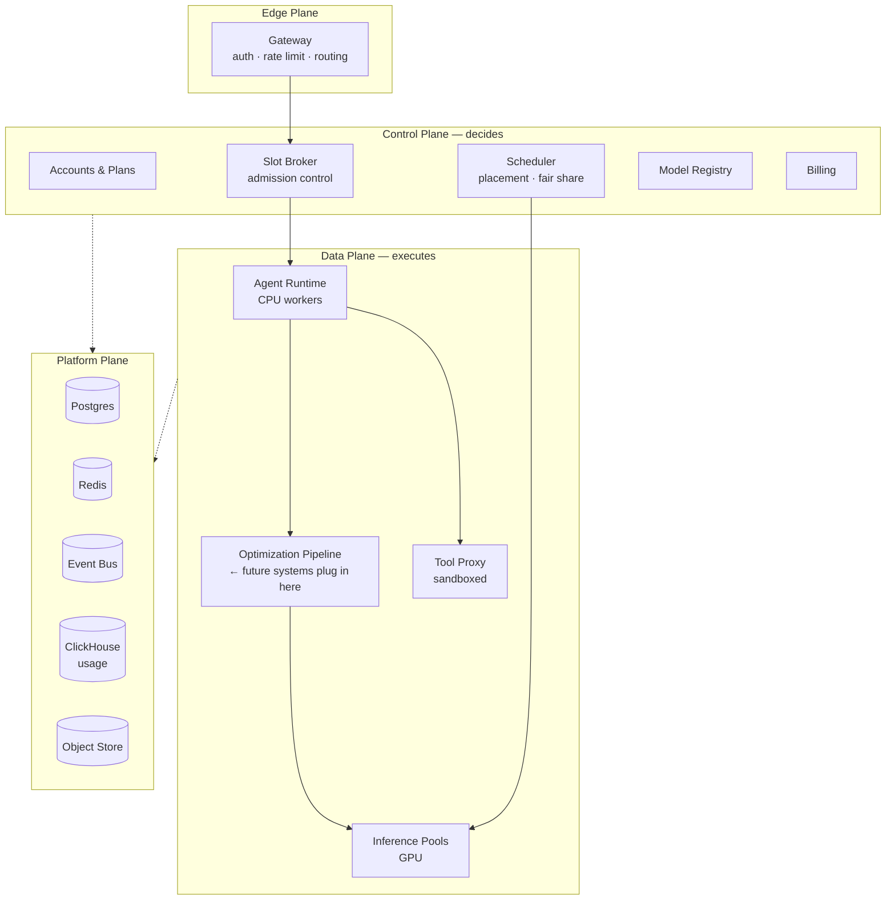

# Open Agent — Platform Master Plan

> **Status:** Skeleton / v0.1 — structural blueprint only.
> Every number in this document set is a **placeholder** until benchmarked on real hardware.
> Nothing here is implemented yet. This is the layout we build against.

---

## 1. What we are building

A hosting company for **advanced open-source LLMs**, sold to customers as
**agents** rather than as tokens.

The product promise:

> **Unlimited tokens every month. A fixed number of agents that can run at once.**

The customer never sees a token counter and never gets a surprise bill. What
they buy is *concurrency*: how many agents they may have working at the same
moment. A Solo plan runs 2 agents. A Team plan runs 20. Each of those agents
may run all month without stopping.

## 2. The one idea the whole architecture is built on

Selling unlimited tokens is only safe if a single subscription can never cost
more than a known ceiling. We get that ceiling from a simple substitution:

| | Traditional API | Open Agent |
|---|---|---|
| Unit of sale | 1M tokens | 1 concurrent agent slot |
| Scarce resource | quota balance | GPU-seconds |
| Customer-visible limit | monthly token cap | active agent count |
| Cost driver | tokens consumed | **slot-seconds × throughput ceiling** |

A **slot** is the atomic thing we sell, meter, schedule, and price. Because a
slot has a **hard sustained tokens-per-second ceiling**, the worst possible
customer — one agent generating flat-out, 24 hours a day, 30 days a month —
has a cost we can compute in advance:

```
worst_case_slot_cost_per_month
    = slot_rate_ceiling (tok/s)
    × 2,592,000 (seconds per month)
    × cost_per_token (from measured node throughput)
```

**Price above that number and the plan cannot lose money.** See
[`docs/13-capacity-and-economics.md`](docs/13-capacity-and-economics.md) for the
worked model.

Then the margin story becomes the inverse of the usual one:

> **Price for the worst case. Profit from the average.**

Real agents idle constantly — waiting on tools, on the network, on a human.
Measured duty cycle is typically 5–20%, not 100%. Every optimization system we
add later pushes the *average* further below the *ceiling* we already priced
for. That is the room this skeleton is built to leave.

## 3. The four planes



| Plane | Owns | Fails how |
|---|---|---|
| **Edge** | TLS, authn, tenant resolution, coarse rate limits | Degrades to 503; no data loss |
| **Control** | Who may run what, where it runs, what it costs | Existing agents keep running; no *new* agents admitted |
| **Data** | Actually running agents and generating tokens | Individual sessions drop; slots released by lease expiry |
| **Platform** | State, queues, metrics, artifacts | Hard dependency — this is the blast radius to design around |

The important property: **the control plane can go down without killing running
agents**, and **the data plane can lose a node without losing a slot** (leases
expire and are re-granted). Everything is built to make those two statements
true.

## 4. Document set

Read in order for the full picture; each is independently useful.

| # | Document | Answers |
|---|---|---|
| 01 | [Product & Plans](docs/01-product-and-plans.md) | What we sell, tier table, what "unlimited" legally means |
| 02 | [Architecture Overview](docs/02-architecture-overview.md) | Services, request lifecycle, boundaries |
| 03 | [Infrastructure Layout](docs/03-infrastructure-layout.md) | Racks, nodes, GPU pools, network, regions |
| 04 | [Inference Layer](docs/04-inference-layer.md) | Engines, model classes, batching, KV cache |
| 05 | [Agent Runtime & Slots](docs/05-agent-runtime-and-slots.md) | Slot lifecycle, leases, admission, the agent loop |
| 06 | [Control Plane](docs/06-control-plane.md) | Each control service, its contract |
| 07 | [Data Model](docs/07-data-model.md) | Schema skeleton |
| 08 | [API Surface](docs/08-api-surface.md) | Public + internal endpoints |
| 09 | [Metering & Billing](docs/09-metering-and-billing.md) | Slot-seconds, usage events, invoicing |
| 10 | [**Optimization Framework**](docs/10-optimization-framework.md) | **The extension points your future systems plug into** |
| 11 | [Observability](docs/11-observability.md) | Metrics, logs, traces, SLOs |
| 12 | [Security & Tenancy](docs/12-security-and-tenancy.md) | Isolation, secrets, sandboxing |
| 13 | [Capacity & Economics](docs/13-capacity-and-economics.md) | The profitability math, worst-case model |
| 14 | [Repo & Deployment Layout](docs/14-repo-and-deployment-layout.md) | Directory tree, environments, CI/CD |
| 15 | [Roadmap](docs/15-roadmap.md) | Build phases |
| — | [Glossary](docs/GLOSSARY.md) | Terms used precisely throughout |

## 5. Where the optimizations go

You said you have a set of token-reduction systems to add. This skeleton
reserves a **five-stage pipeline** on the hot path, each stage a plugin point
with a defined contract, so those systems drop in without re-architecting:

```
  Agent step
      │
      ├─ Stage 1  ADMIT      — should this call happen at all?
      ├─ Stage 2  ASSEMBLE   — what exactly goes into the prompt?
      ├─ Stage 3  ROUTE      — which model / engine / pool serves it?
      ├─ Stage 4  DECODE     — how are the tokens produced?
      └─ Stage 5  SETTLE     — what do we keep, cache, and record?
      │
  Inference
```

Every optimization you describe will land in one of those five stages. The
contract for each is specified in
[`docs/10-optimization-framework.md`](docs/10-optimization-framework.md), along
with a stub registry, a measurement harness, and the rule that **every stage
must be independently disableable per tenant** so we can A/B any optimization
against real traffic.

## 6. Deliberate non-goals for v0.1

We are building the skeleton. These are consciously deferred, not forgotten:

- No model training or fine-tuning. Inference only.
- No multi-region active-active. Single region, DR plan only.
- No custom kernels or engine forks. Use vLLM/SGLang as shipped.
- No autoscaling beyond a fixed floor/ceiling per pool.
- No optimization implementations — only the seams they mount to.
- No marketplace, no BYO-model, no fine-tune hosting.

## 7. Open decisions

Tracked here so they do not get silently resolved by accident.

| ID | Decision | Blocking? | Notes |
|---|---|---|---|
| D-01 | Own hardware vs. rent GPUs | Phase 3 | Rent for Phase 0–2; economics flip around ~60% sustained utilization |
| D-02 | Flagship model family | Phase 1 | Large MoE preferred: high capability per active parameter |
| D-03 | vLLM vs. SGLang as primary engine | Phase 1 | Bench both; SGLang's prefix cache matters for agents |
| D-04 | Agent loop authored by us vs. adopted | Phase 1 | Ours, so Stage 1–5 hooks are first-class |
| D-05 | Per-slot rate ceiling value | Phase 2 | The single most important business number |
| D-06 | Overcommit ratio (slots sold : slots servable) | Phase 2 | Derived from measured duty cycle |
| D-07 | Cold-start policy for idle slots | Phase 2 | Trade memory for latency |

---

*Next: read [`docs/01-product-and-plans.md`](docs/01-product-and-plans.md).*
