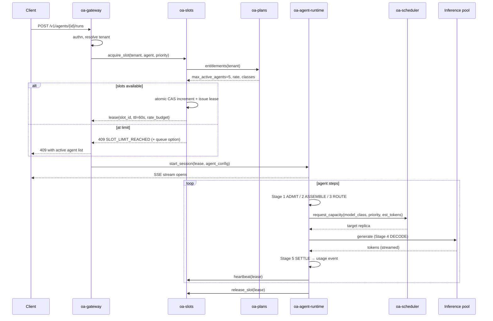

# 02 — Architecture Overview

> Skeleton. Service boundaries are the deliverable here; internals are stubs.

## 1. Service inventory

Naming convention: `oa-<service>`. Every service is independently deployable
and owns its own data or explicitly borrows another's via API.

### Edge plane

| Service | Language | Responsibility |
|---|---|---|
| `oa-gateway` | Go | TLS, authn, tenant resolution, coarse rate limit, request routing, SSE/WebSocket fan-out |

### Control plane — *decides*

| Service | Language | Responsibility |
|---|---|---|
| `oa-accounts` | Go | Orgs, users, seats, API keys, OAuth |
| `oa-plans` | Go | Plan definitions, entitlement resolution, feature flags |
| `oa-slots` | Go | **Slot broker.** Admission control, leases, heartbeats, reaping |
| `oa-scheduler` | Go | Placement of work onto inference pools, fair-share, priority queues |
| `oa-registry` | Go | Model registry: classes → models → engine configs → deployed replicas |
| `oa-billing` | Go | Subscriptions, invoices, payment provider integration |

### Data plane — *executes*

| Service | Language | Responsibility |
|---|---|---|
| `oa-agent-runtime` | Python | The agent loop. Owns a session, drives Stage 1–5, calls tools and inference |
| `oa-inference` | — | vLLM / SGLang replicas. Not our code; our config and lifecycle |
| `oa-toolproxy` | Go | Sandboxed tool execution, egress policy, result normalization |
| `oa-optimizer` | Python | Library, not a service in v0.1. The Stage 1–5 pipeline (see doc 10) |

### Platform plane

| Component | Role |
|---|---|
| PostgreSQL | System of record: accounts, plans, agents, sessions, slot ledger |
| Redis | Slot counters, leases, rate-limit buckets, hot entitlement cache |
| NATS (or Kafka) | Event bus: usage events, lifecycle events, control signals |
| ClickHouse | Usage/metering warehouse, analytics, per-slot cost attribution |
| S3 / MinIO | Model weights, artifacts, transcripts, cache spill |
| Prometheus + Grafana + Loki + Tempo | Observability stack |

**Why Go for control and Python for the data plane:** control services are
concurrency-heavy, latency-sensitive, and mostly I/O — Go fits. The agent
runtime and optimization pipeline live in the ML ecosystem — Python fits, and
keeps the future optimization systems in the language their libraries expect.

## 2. Lifecycle: starting an agent

## 3. The critical invariants

These are the properties every change must preserve. Violating one is a
platform bug, not a feature trade-off.

| # | Invariant | Enforced by |
|---|---|---|
| I-1 | A tenant never exceeds `max_active_agents` | `oa-slots` atomic CAS on acquire |
| I-2 | A slot never sustains more than its rate ceiling | Token bucket, checked per decode batch |
| I-3 | A crashed runtime never permanently leaks a slot | Lease TTL + heartbeat expiry reaper |
| I-4 | Control plane downtime never kills a running agent | Leases are cached; renewal degrades open |
| I-5 | Every generated token maps to exactly one usage event | Idempotency key on `(session_id, step_id)` |
| I-6 | A tenant's data is never in another tenant's prompt | Cache keys namespaced by tenant (see doc 10 §6) |
| I-7 | Any optimization stage can be disabled per tenant | Stage registry reads entitlements |
| I-8 | All sub-agents of a session draw from that session's **single** rate bucket | One limiter object per session; CI invariant test |

I-8 exists because sub-agents (doc 18) are the one feature that can multiply a
slot's consumption without multiplying its price. It is invisible when broken —
nothing errors, costs just rise — so it is enforced structurally and tested in CI.

I-3 and I-4 pull in opposite directions and the resolution is deliberate:
**leases fail open for renewal, fail closed for acquisition.** A running agent
whose control plane is unreachable keeps running to the end of its lease and
gets a grace extension; a *new* agent cannot start without a fresh grant. We
would rather briefly over-serve an existing customer than wrongly kill their
work, and rather refuse a new start than lose count.

## 4. Communication patterns

| Path | Transport | Why |
|---|---|---|
| Client → Gateway | HTTPS + SSE | Streaming tokens; SSE is enough, no WS complexity in v0.1 |
| Gateway → Control | gRPC | Typed, low-latency, on the hot path |
| Runtime → Inference | HTTP (OpenAI-compatible) | Engine-native; lets us swap vLLM/SGLang freely |
| Anything → Usage | NATS, fire-and-forget | Metering must never block a token |
| Control → Control | gRPC + shared Postgres | Small enough to keep simple |

**Metering is asynchronous on purpose.** Blocking generation on a billing write
is how a billing outage becomes a platform outage. Usage events go to a durable
queue; loss is bounded and reconciled from the slot ledger, which is the actual
source of billing truth.

## 5. Failure behavior

| Failure | Blast radius | Behavior |
|---|---|---|
| `oa-gateway` node dies | Connections on that node | LB re-routes; client reconnects to stream |
| `oa-slots` unavailable | New agent starts | Running agents continue on cached leases (I-4); starts 503 |
| `oa-plans` unavailable | Entitlement refresh | Serve last-known entitlements from Redis, TTL 15 min |
| Postgres primary fails | Writes | Failover to replica; slots read from Redis meanwhile |
| Redis fails | Slot accounting | **Hard stop on new admissions.** Rebuild counters from Postgres ledger |
| An inference replica dies | In-flight requests on it | Scheduler drains, retries idempotent step on another replica |
| A whole GPU pool dies | That model class | Degrade class L → M with tenant notice; never silently downgrade |

The Redis row is the sharpest edge: slot counting is the thing we cannot
approximate, so losing it stops admissions rather than guessing. Rebuild is
from the durable ledger in Postgres.

## 6. What is deliberately not a service yet

Kept in-process until there is a reason to split, to keep v0.1 operable:

- **Optimizer** — a library inside `oa-agent-runtime`. Becomes a service only
  if a stage needs its own GPUs or independent scaling.
- **Cache** — Redis + engine-native prefix cache. No bespoke cache service.
- **Router** — a function inside Stage 3, not a standalone model router.

---
*Next: [03 — Infrastructure Layout](03-infrastructure-layout.md)*
