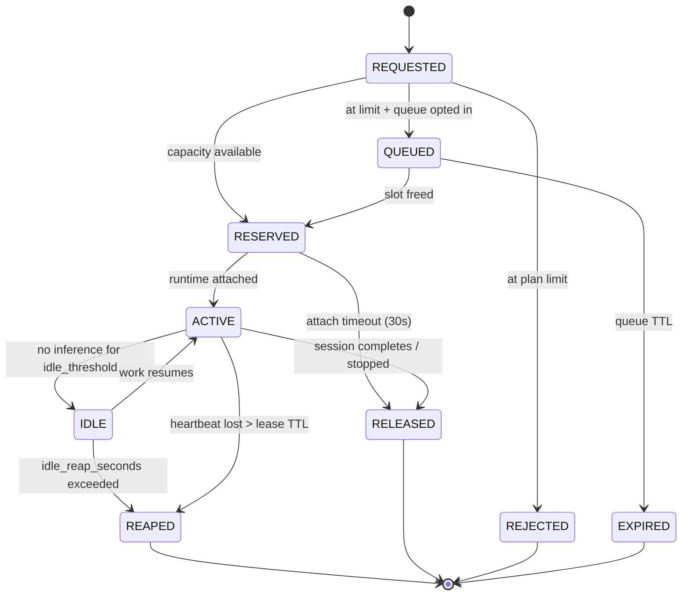

# 05 — Agent Runtime & Slots

> Skeleton. This is the mechanism that makes the product's headline limit real,
> so it is specified more tightly than the rest.

## 1. Definitions

| Term | Meaning |
|---|---|
| **Agent** | A saved configuration: model class, system prompt, tools, memory. Free, unlimited. |
| **Session** (run) | One execution of an agent. Holds a slot from start to finish. |
| **Slot** | The right to have one session active. **The unit we sell.** |
| **Lease** | A time-bounded grant of a slot, renewed by heartbeat. |
| **Step** | One iteration of the agent loop: assemble → infer → act. |

The distinction that makes the product work: **agents are free, sessions are
metered.** Customers create as many agents as they want; concurrency is the
only scarcity.

## 2. Slot state machine



### Billing-relevant distinction

| State | Counts against `max_active_agents` | Consumes GPU |
|---|---|---|
| RESERVED | Yes | No |
| ACTIVE | Yes | Yes, while generating |
| IDLE | **Yes** | No |
| REAPED / RELEASED | No | No |

**IDLE still holds the slot.** An agent waiting on a slow tool or a human reply
keeps its context, its prefix cache affinity, and its place in line. This is
what customers expect and it costs us almost nothing (CPU memory, not GPU), but
it means idle reaping is the pressure valve that keeps abandoned sessions from
consuming a plan's whole allowance. Reap timers are a published plan feature.

## 3. Admission control

The hot path. Must be atomic, fast (< 5 ms p99), and correct under concurrency.

```
acquire_slot(tenant_id, agent_id, priority) -> Lease | Rejection

  1. entitlements = plans.get(tenant_id)            # Redis cache, 15 min TTL
  2. Redis Lua, atomic:
       current = GET slots:active:{tenant_id}
       IF current >= entitlements.max_active_agents:
           RETURN REJECTED
       INCR slots:active:{tenant_id}
       SET  lease:{slot_id} = {tenant, agent, expires_at} EX 60
  3. append to Postgres slot_ledger (async, durable truth)
  4. RETURN Lease{slot_id, ttl=60s, rate_budget, priority}
```

Design notes, each load-bearing:

- **Redis Lua for atomicity.** Read-then-write in application code lets two
  concurrent starts both observe `4 < 5` and both admit — the exact bug that
  breaks the product's core promise. One script, one round trip.
- **Postgres ledger is the durable truth**, Redis is the fast counter. On Redis
  loss, rebuild counters from the ledger (doc 02 §5) rather than guess.
- **Short TTL (60 s) + frequent heartbeat (20 s)** bounds slot leakage from a
  crashed runtime to one minute.
- Rejection returns *which* agents currently hold slots, so the UI can offer
  "stop one and start this" instead of a dead-end error.

## 4. Lease renewal — the fail-open exception

Per invariant I-4, a control plane outage must not kill running work:

```
renew(lease) ->
    IF slots service reachable:  extend to now + 60s
    ELSE:                        runtime self-extends up to grace_max (5 min),
                                 logs degraded mode, keeps running,
                                 refuses to start any NEW session
```

We accept briefly over-serving an existing customer; we never accept killing
their in-flight work over our own outage. The asymmetry is deliberate:
**renewals fail open, acquisitions fail closed.**

## 5. Rate limiting — the profitability enforcement point

Every slot carries a token bucket. This is where invariant I-2 is enforced and,
per doc 01 §4, where unlimited-token economics are actually made safe.

```
bucket:
  capacity     = burst_tps × burst_window_s     # e.g. 100 × 60 = 6000 tokens
  refill_rate  = sustained_tps                  # e.g. 25 tok/s
```

Checked **per decode chunk, not per request** — a single long generation must
not slip past a per-request check. On exhaustion the session is *throttled*,
never errored: generation continues at exactly the refill rate. From the
customer's side this is a slow response, not a failure, which is what
"unlimited" has to feel like.

Ceilings are per-slot, so a 20-slot plan gets 20 independent buckets; nothing
is shared across a tenant's slots.

## 6. The agent loop

`oa-agent-runtime` owns one session per coroutine. The five optimization
stages ([doc 10](10-optimization-framework.md)) are called out inline — this
loop is where they mount.

```python
async def run_session(lease: Lease, agent: AgentConfig) -> None:
    ctx = Context(agent)
    async with SlotHeartbeat(lease):                 # renews every 20s
        for step in range(agent.max_steps):

            # ── Stage 1: ADMIT ─────────────────────────────
            verdict = await pipeline.admit(ctx, step)
            if verdict.skip:
                continue                             # answered w/o inference
            if verdict.halt:
                break

            # ── Stage 2: ASSEMBLE ──────────────────────────
            prompt = await pipeline.assemble(ctx)    # compaction, retrieval

            # ── Stage 3: ROUTE ─────────────────────────────
            target = await pipeline.route(ctx, prompt)

            # ── Stage 4: DECODE ────────────────────────────
            async for chunk in inference.stream(target, prompt):
                await rate_limiter.consume(lease, chunk.tokens)   # I-2
                await client.emit(chunk)
                ctx.append(chunk)

            # ── Stage 5: SETTLE ────────────────────────────
            await pipeline.settle(ctx, step)         # cache write, usage event

            if ctx.wants_tools():
                results = await toolproxy.execute(ctx.pending_tools())
                ctx.append_tool_results(results)
                continue
            break
    await slots.release(lease)
```

Properties worth preserving as this grows:

- **One coroutine per session** — thousands per CPU node, no GPU held while idle.
- **Steps are idempotent**, keyed `(session_id, step_id)`, so retries are safe.
- **Rate limiting is inside the token stream**, not around the request.
- **Every stage is a call into a registry**, never inline logic. Default
  implementations are pass-throughs, so the loop is complete and correct today
  and gains capability as stages are filled in.

## 7. Runtime sizing

| Resource | Per active slot (placeholder) |
|---|---|
| RAM | 200–500 MB (context buffer dominates) |
| vCPU | 0.05–0.2 (orchestration only, bursts on tokenization) |
| Sockets | 2–4 (client stream, inference, tools) |

→ a 64 vCPU / 128 GB node carries roughly **250–500 active slots**, RAM-bound.
Long-context sessions push RAM per slot up, which is another reason context
compaction (Stage 2) pays twice: GPU KV cache *and* runtime memory.

## 8. Overcommit (D-06)

Sold slots exceed simultaneously-servable slots, because measured duty cycle is
far below 100%.

```
required_gpu_throughput = sold_slots × sustained_tps × measured_duty_cycle
```

- Start Phase 2 at **1.0× (no overcommit)** until real duty cycle is measured.
- Then raise deliberately, with the P0 latency SLO as the brake.
- **Never overcommit P0.** Enterprise reserved capacity is exactly that.

Overcommit is a real business lever and a real risk. It gets its own dashboard
and an automatic freeze if P0 TTFT breaches SLO — the ratio must never be
raised by drift, only by decision.

## 9. Deferred

- Slot queueing UX and fairness within a tenant's queue
- Session migration between runtime nodes (checkpoint/restore)
- Slot handoff for long-running background agents
- Per-agent (not per-slot) rate policies
- Suspend-to-disk for IDLE sessions to reclaim RAM

---
*Next: [06 — Control Plane](06-control-plane.md)*
